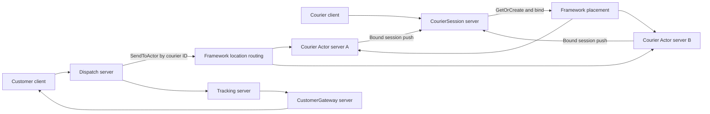

# DeliveryDispatch 샘플

`DeliveryDispatch`는 배송 생성, 배송원 제안, timeout 재배정과 고객 상태 알림을
하나의 흐름으로 보여 주는 .NET Framework 샘플이다.

공통 시나리오 계약은
[`DeliveryDispatch 공통 샘플`](../../../../doc/framework/common/sample/deliverydispatch/README.ko.md)에
있다. 이 문서는 .NET 구현의 실행 방법과 역할 구성을 설명한다.

## 핵심 계약

배송원은 Actor로 유지한다. 애플리케이션은 배송원 Actor를 생성할 물리
MeshNode를 선택하지 않는다. 두 Courier Actor Server가 같은 stable type을
등록하며, Framework가 현재 사용 가능한 node와 capacity를 보고 최초 위치를
선택한다.

Actor ID는 물리 node와 무관한 논리 주소다. 배송원 stream이 연결되면
`CourierSession`이 `GetOrCreate`로 Actor를 준비하고 session을 bind한다.
배차 worker는 `SendToActor`로 `OfferDeliveryMsg`를 보낸다. Framework가 location
store에서 현재 owner를 찾으므로 애플리케이션 코드에는 Node RID나 선호 node가
필요하지 않다.

Actor가 relocation된 뒤에도 같은 Actor ID를 사용한다. 이전 위치로 이미 전달 중이던
메시지는 Framework의 Message Follow 규칙에 따라 현재 위치로 전달된다.



## 역할

| 실행 역할 | 책임 |
|---|---|
| `Dispatch` | HTTP 요청을 받고 `AssignDeliveryMsg`를 처리한다. 후보 배송원을 선택하고 Actor에 제안을 보낸다. |
| `CourierSession` | 배송원 stream을 받고 Actor를 준비한 뒤 현재 session을 bind한다. |
| `CourierActorNode1`, `CourierActorNode2` | 같은 Courier Actor stable type을 등록한다. 두 역할 모두 Framework placement 후보가 된다. |
| `Tracking` | 배송 상태와 검증 evidence를 기록한다. |
| `CustomerGateway` | 고객 stream을 받고 고객 Actor와 session을 bind한다. |

두 Courier Actor Server는 특정 배송원 ID에 고정되지 않는다. 여러 server가 같은
Actor type을 제공할 때도 호출자가 물리 node 정보를 관리하지 않는 구성을 검증하기
위해 둘로 나눈다.

## 배송 흐름

1. 고객이 `Dispatch` HTTP endpoint에 배송 생성을 요청한다.
2. HTTP handler가 같은 server의 dispatch channel에 `AssignDeliveryMsg`를 제출한다.
3. 배송원 stream이 연결되면 `CourierSession`이 배송원 ID로 Actor를 준비하고 session을
   bind한다.
4. 배차 worker가 먼저 `courier-a`를 선택하고 Actor ID로 `OfferDeliveryMsg`를 보낸다.
5. `courier-a`가 제한 시간 안에 응답하지 않으면 worker가 `courier-b`에게 다시 제안한다.
6. 배송원이 제안을 수락하면 배정, 픽업과 완료 상태를 `Tracking`에 보낸다.
7. `CustomerGateway`는 고객 Actor에 bind된 stream으로 상태를 push한다.

이 시나리오는 배송원 선택 순서는 검증하지만 배송원이 어느 물리 node에 배치됐는지는
검증하지 않는다. 물리 node 선택은 Framework 책임이다.

## 실행

Linux:

```bash
./framework/languages/dotnet/samples/DeliveryDispatch/run_sample.sh
```

PowerShell:

```powershell
./framework/languages/dotnet/samples/DeliveryDispatch/run_sample.ps1
```

`run_sample.sh`와 `run_sample.ps1`은 실행마다 전용 Docker Redis 컨테이너를
location store로 시작한다. 외부 Redis endpoint를 재사용하지 않는다. 실행별 key
prefix와 log directory를 사용하므로 동시에 실행한 샘플이 상태를 공유하지 않는다.

## 성공 조건

runner는 다음 결과를 확인한다.

- 두 배송원 session이 연결된다.
- `courier-a`의 응답 timeout 뒤 `courier-b`에게 제안한다.
- `courier-b`가 제안을 수락한다.
- 고객이 배송 상태 변경을 순서대로 받는다.
- 서버가 기록한 evidence와 client 결과가 일치한다.

성공하면 `deliverydispatch=completed`와
`deliverydispatch-runner-evidence=completed`를 출력한다.
